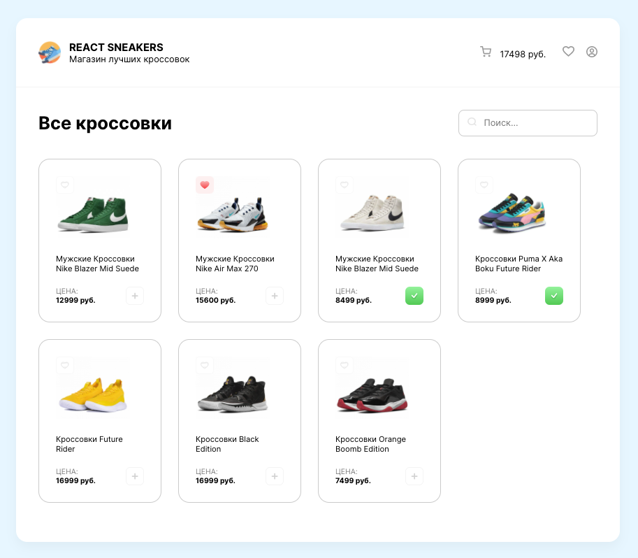

# [react-online-shop](https://artem-chebotarev.github.io/react-online-shop/) || Интернет-магазин кроссовок

  

In the project directory, you can run:

### `npm start`

Runs the app in the development mode.\
Open [http://localhost:3000](http://localhost:3000) to view it in the browser.
